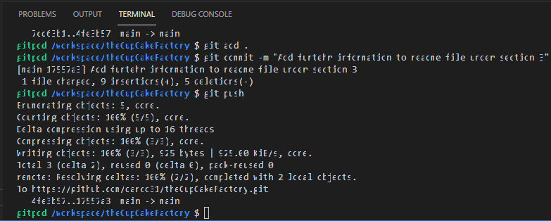

# Stephen D'Arcy - The Cupcake Factory

​
## 1. The Cupcake Factory

### 1.1 About
* A website dedicated to cake baking that includes a fast effiecient delivey service for customers. The website features an array of cakes we bake and an easy to use contact form for anything else a customer may want to order.We offer an excellent delivery service within certain geographical ranges. The goal is to promote our small online business while encouraging others to try baking for themselves.  

### 1.2 The business goals of this website are:
* To build a regular customer base.
* To always provide quaility products.

### 1.3 The customer goals of this website are:
* To visit and browse our products and to order their products with ease.
* Clear easy to find product pricing and delievry prices.

---
 
## 2. User Experience

### 2.1 Project goals:
* The main goal of the project is to advertise our bussiness and products to a wider audience.
* To increase visitors to the website.
* To use the website as a platform to expand our business
​
### 2.2 Design:
* The design is very simplistic and uses pastel colors to mirror what may be found on a lot of cakes and baked goods. It has a clear navigation menu and the page is clearly    lablled and it is easy to go from one page to another. 
* The images are sized correctly and each page is designed to look like the home page.
​
### 2.3 User Stories
* As a user I want navigate between pages.
* As a user I want be able to view images pf products.
* As a user I want to be able to see the prices of products in a clear manner.
* As a user I want to be able to contact the company easily.

### 2.4 Target Audience

#### The target audience for our website is mainly adults looking to make purchaes of our products and to view our product range.

---

## 3. Features

### 3.1 

### Home page 

The home page features a hero image that is animated to draw the attention of the visitor to the purpose of our business. The image does remain animated from desktop down to mobile size. Under the hero image we have two small paragraphs outlining outlining why a customer should use our services and a question as to waht we do. We have a lkist outlining some of the occasions we cater for and a call to action button to contact us if anything else is reuired or any special requests are needed.

Further down the home page I have three images that are animated to show the transaforamtion of some of our bakes. These images are used as far down as tablet size but one we move to mobile sizes I have decided to hide the images to improve performance on small screen sizes.

### Gallery Page

The Gallery page has a small selection of the ckaes that we can produce. One the user hovers over them the are designed to satnd out with a box shadow. The page also include tha call to action contact button in case the user would like to make contact and request one of the cakes in the gallery.

### Contact Page

The Contact page follows the samll design principles as the othe pages. The animated hero image banner is located below the navigation menu. Below this hero imgae is our contact form. The form has certain fields that must be completed before submitting. There is a text box for messaging and some checkboxs for or more popular orders. One checkbox gives the customer the option to choose the size of their cupcake orders. Once the conatct form has been completed the user will get a thank you message from a hidden page. 

### Prices Page

The Prices page dispalys some of our prices for again our more popuar cakes. This is coupled with seperate prices for different size cakes. We have clearly outlined our delivey costs and that we only deliver to a certtain geogarpical area. If any other delivery areas further  than stated we adviose the customer to conatct us with their request.

### All pages

The top of the page has an easy to use navigation bar that has a underlined border to emphsise where the user is on the website. All the pages have an animated banner, the opacity has been turned down sligthly. This is engage the user and also visually show the user what the site represents and what our business is. 
The footer contains copyright information and links to social media sites that open in seperate pages.

---

## 4. Technology Used In Design

### 4.1 HTML

* HTML5 semantic code is used in all of the four website pages. There are clearly defined areas such as main, sections, headers and footers as well as list items and tables.

### 4.2 CSS

* CSS has been used to add styles nad animations to the site amking it more appealing for people visiting us. 

* [Google Fonts:](https://fonts.google.com/)
    - Google fonts was used to import the fonts Lato and Raleway that is used throughout the site.
* [Font Awesome:](https://fontawesome.com/)
    - Font Awesome was used to add icons for visual and user experience (UX) purposes.
* [Gitpod](https://gitpod.io/)
    - Gitpod was used to develop the website.
* [GitHub:](https://github.com/)
    - GitHub is used to store the projects code after being pushed from Git. And to host the project.
* [Birme Image Resizing:](https://www.birme.net/?target_width=700&target_height=100&auto_focal=false)
    - Image Resizer was used to resizing images and edit profile photos for the website.
* [Balsamic:](https://balsamiq.com/)
    - Balsamiq was used during the design process to create Wireframes.
* [Responsive Design Checker:](http://ami.responsivedesign.is/)
    - Am I Respnsive was used in the testing process to check responsiveness on various devices.
* [W3C Markup Validator](https://validator.w3.org/#validate_by_input)
    - Used to validate the HTML code.
* [W3C CSS Validator](https://jigsaw.w3.org/css-validator/#validate_by_input)
    - Used to validate the CSS code.

---

## 5. Testing

testing was manually completed throught the use of Googles Chrome browser and Firefox browser in conjuntion with their development tools accesssed throught their website.

### 5.1 User Stories Testing

* #### As a user I want navigate between pages.
On the home page in the top right their are navigation links that seemless work between each page the user wants to visit. The page the user is on is identified by the underlined border on each link as the click through the website.

* #### As a user I want be able to view images pf products.
When the user navigates to the Galley page the images for the products we offer are clearly laid out and visable to the user. Thye can hover over each image and the current image will transistion a small bit with a shadow to indicate which image is being viewed.

* #### As a user I want to be able to see the prices of products in a clear manner.
The user can nvigate through the navigation menu to the prices page where there is a list of our price laid out for differnet size products. We encourge the use of the conatct page for any other requests that use rmay need.

* #### As a user I want to be able to contact the company easily.
the copntact page is laid out with a contact from in the cneter of the page under the main hero image. Each field is identificable and any fields that are required are called out when the user clicks the contant us button. There is also a rest button in case of any user mistakes.

### 5.2 Manual Testing
Navigation - Repeated steps on all pages.
Click on logo to confirm that it navigates to landing page.
Click on all navigation links to verify that they direct to the indicated page.
Verify that the current page the user is on, is highlighted as active in the menu.
Verify that the navigation menu shifts to from hamburger on screens of 991px and above.
Landing page
Verify that the scroll prompt works only on screens 991px and above.
Verify that the link to make an appointment directs the user to the contact page.
Portfolio
Verify that the image carousel is functional, and clicks through the images.
Verify that images are confined to the carousel and not overflowing it.
Paint
Verify that the stockist button pops open a modal.
Verify that the modal contains a table with stockist information.
Verify that modal closes when the 'X' button is selected, or the user clicks on the screen anywhere outside of the modal window.
Contact
Verify that all elements that are set to required are working.
Verify that valid email address is needed with relevant '@' included.
Verify that 'Submit' button directs user to a success page.
Form success
Verify that navigation elements work the same as all other pages.
Verify that the page automatically redirects the user to the services page after 10 seconds, as indicated.
Footer - Repeated steps on all pages.
Verify that the social media links open in a new tab.
Verify that the email link directs the user to a custom 404 error page when selected.
Verify that the 404 error page 'Return home' link brings the user back to the landing page.
Verify that the phone number shown is dialled when selected.
Verify that the website hyperlink directs the user back to the landing page.

### Additional Testing  

W3C - HTML Validator

W3C - CSS Validator

---

## 6. Deployment

---

## 7. Acknoweldgments

---

## 7. Bugs

### 3.1 Gitpod

Bug found in Gitpod where the text in the terminal is virtually unreadble making speeling mistakes hard to see when writing commit messages.

